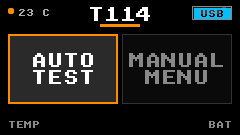
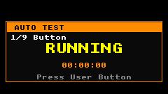
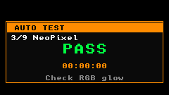
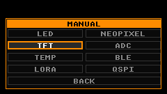
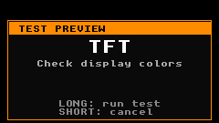
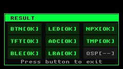
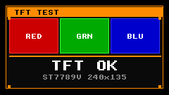

<div align="center">

# T114 Validator

Hardware validation application for the **Heltec Mesh Node T114 v2.0** running on [Zephyr](https://zephyrproject.org).

<p align="center">
  
</p>

<p align="center">
  <a href="https://zephyrproject.org"></a>
  <a href="https://heltec.org/project/mesh-node-t114/"></a>
  <a href="#"></a>
  <a href="#"></a>
  <a href="#license"></a>
</p>

<p align="center">
  <a href="#english"><kbd>&nbsp;&nbsp;English&nbsp;&nbsp;</kbd></a>
  &nbsp;&nbsp;&nbsp;&bull;&nbsp;&nbsp;&nbsp;
  <a href="#español"><kbd>&nbsp;&nbsp;Español&nbsp;&nbsp;</kbd></a>
</p>

</div>

---

## English

### What is this?

The **T114 Validator** is an interactive hardware validation application for the [Heltec Mesh Node T114 v2.0](https://heltec.org/project/mesh-node-t114/). It was built as a companion tool to verify that the Zephyr board support works correctly on real hardware.

The app runs a retro-styled LVGL interface on the board's 240×135 TFT display. It exercises every major on-board peripheral through a two-button interaction model (short press / long press). Use it to validate a fresh board, confirm a Zephyr build, or simply explore what the hardware can do.

This project is part of the effort to upstream Heltec Mesh Node T114 v2.0 support to Zephyr. The validator lives in this fork branch as a practical way to test and demonstrate the board definition.

### What it validates

| Peripheral | What it checks | Zephyr subsystem |
|------------|---------------|------------------|
| **Button** | Short and long press detection | `input` |
| **LED** | Green user LED blink | `gpio-leds` |
| **NeoPixel** | Two WS2812B LEDs cycling RGB | `led-strip` |
| **TFT** | Color pattern on ST7789V display | `display` + LVGL |
| **ADC** | Battery voltage via voltage divider | `adc` |
| **Temperature** | nRF52840 die temperature | `sensor` |
| **BLE** | Bluetooth controller initialization | `bluetooth` |
| **LoRa** | SX1262 modem configuration and TX | `lora` |
| **QSPI Flash** | MX25R1635F probe (optional) | `flash` |

> **Note:** QSPI may report `SKIP` if the U9 flash footprint is not populated on your board.

### Hardware

- **Board:** Heltec Mesh Node T114 v2.0
- **SoC:** Nordic nRF52840 (ARM Cortex-M4F @ 64 MHz)
- **Display:** 1.14" ST7789V TFT-LCD (240×135)
- **Radio:** Semtech SX1262 LoRa modem
- **LEDs:** 1 green LED + 2 WS2812B NeoPixels
- **Bootloader:** HT-n5262 UF2

### Gallery

| Dashboard | Auto Test Running | Auto Test Pass |
|:---------:|:-----------------:|:--------------:|
|  |  |  |

| Manual Menu | Test Preview | Result Summary |
|:-----------:|:------------:|:--------------:|
|  |  |  |

| TFT Color Test |
|:--------------:|
|  |

### Quick Start

#### Build

```bash
west build -b heltec_mesh_node_t114/nrf52840/uf2 -s samples/t114_validator
```

#### Flash (macOS)

1. Connect the board via USB.
2. Double-press the reset button to enter UF2 bootloader mode.
3. A volume named `HT-n5262` will appear.
4. Copy the firmware:

```bash
cp -X build/zephyr/zephyr.uf2 /Volumes/HT-n5262/
```

The board resets automatically and runs the validator.

#### Flash (Linux / Windows)

Copy `build/zephyr/zephyr.uf2` to the UF2 mass storage device that appears when the board is in bootloader mode.

### Controls

| Input | Action |
|-------|--------|
| **Short press** | Move selection / cancel |
| **Long press** (≥ 800 ms) | Enter / run / confirm |

### Modes

- **Auto Test**: Runs all 9 tests sequentially and presents a pass/fail summary.
- **Manual Menu**: Choose individual tests from a scrollable menu.
- **Test Preview**: Shows test instructions before execution in manual mode.
- **Result Screen**: Grid showing `OK`, `FAIL`, or `SKIP` for each test.

### How it works

The validator is a standard Zephyr sample with a modular structure:

```
samples/t114_validator/
├── src/
│   ├── main.c
│   ├── button.c
│   ├── test.c
│   ├── test.h
│   ├── ui.c
│   └── ui.h
├── boards/
│   └── heltec_mesh_node_t114_nrf52840_uf2.overlay
├── prj.conf
└── CMakeLists.txt
```

- `main.c`: Application state machine (dashboard, auto test, manual menu, results)
- `button.c`: Input subsystem with short/long press detection
- `test.c`: Hardware test implementations (LED, NeoPixel, TFT, ADC, temp, BLE, LoRa, QSPI)
- `test.h`: Test result types and function signatures
- `ui.c`: LVGL retro UI (dashboard, menus, preview, result, TFT color test)
- `ui.h`: UI function declarations
- `heltec_mesh_node_t114_nrf52840_uf2.overlay`: Enables vext regulator
- `prj.conf`: Zephyr configuration (LVGL, display, GPIO, ADC, BLE, LoRa, flash, USB, regulator)
- `CMakeLists.txt`: Standard Zephyr CMake project

#### Application flow

`main.c` implements a simple state machine over four screens:

1. **Dashboard**: Displays battery percentage, temperature, USB connection status, and two mode options.
2. **Auto Test**: Iterates through 9 test steps. Each step shows the test name, status (`RUNNING` / `PASS` / `FAIL`), a timer, and instructions for the user.
3. **Manual Menu**: Grid of 8 individual tests plus a `BACK` option.
4. **Result**: Final grid after auto test completion, or per-test result in manual mode.

The button logic in `button.c` uses Zephyr's `input` subsystem with a delayed work item to distinguish short presses (< 800 ms) from long presses.

The test implementations in `test.c` interact directly with Zephyr drivers:

- `test_led_run()` toggles the green LED via GPIO.
- `test_neopixel_run()` updates the WS2812B strip via the `led_strip` API.
- `test_tft_run()` renders a color test pattern via LVGL.
- `test_adc_run()` reads AIN2 through the SAADC with a 1/6 gain and converts raw counts to millivolts using the board's 100 kΩ / 390 kΩ divider.
- `test_temp_run()` samples the nRF52840 die temperature sensor and averages 6 readings over 3 seconds.
- `test_ble_run()` initializes the Bluetooth controller with `bt_enable()`.
- `test_lora_run()` configures the SX1262 at 868 MHz (SF7, BW 125 kHz, CR 4/5) and transmits a test packet.
- `test_qspi_run()` probes the MX25R1635F if the QSPI node is enabled; otherwise reports `SKIP`.

#### Vext overlay

The sample includes a board overlay that enables the `vext` regulator at boot:

```dts
&{/vext} {
	status = "okay";
	regulator-boot-on;
};
```

This is required because NeoPixel, LoRa, and the GNSS connector share a 3V3 rail powered by `vext`. The upstream board definition keeps `vext` disabled by default to avoid powering external peripherals unexpectedly.

### CI Screenshots

UI screenshots are generated automatically on every push to this branch. The GitHub Actions workflow (`.github/workflows/screenshots.yml`) does the following:

1. Builds the app for `native_sim/native/64` on Ubuntu.
2. Runs it inside a virtual framebuffer (`Xvfb`).
3. Captures each screen with `xdotool` + `imagemagick`.
4. Uploads the resulting PNGs as a workflow artifact.

This guarantees that the README images stay in sync with the actual UI code.

### Upstream Status

This validator depends on three upstream PRs that add Heltec Mesh Node T114 v2.0 support to Zephyr:

| PR | Description | Status |
|----|-------------|--------|
| [#108609](https://github.com/zephyrproject-rtos/zephyr/pull/108609) | ST7789V reduced initialization sequence | Submitted |
| [#108610](https://github.com/zephyrproject-rtos/zephyr/pull/108610) | LVGL RGB565X swapped byte-order support | Submitted |
| [#108611](https://github.com/zephyrproject-rtos/zephyr/pull/108611) | Heltec Mesh Node T114 v2.0 board support | Draft |

### Repo Layout

```
samples/t114_validator/
samples/t114_validator_screenshots/
boards/heltec/heltec_mesh_node_t114/
docs/images/t114-validator/
.github/workflows/screenshots.yml
```

- `samples/t114_validator/`: Hardware validation app
- `samples/t114_validator_screenshots/`: native_sim build for CI screenshots
- `boards/heltec/heltec_mesh_node_t114/`: Upstream board support (PR #108611)
- `docs/images/t114-validator/`: UI screenshots
- `.github/workflows/screenshots.yml`: GitHub Actions CI for screenshots

---

## Español

### Qué es esto

El **T114 Validator** es una aplicación interactiva de validación hardware para la [Heltec Mesh Node T114 v2.0](https://heltec.org/project/mesh-node-t114/). Nació como herramienta complementaria para comprobar que el soporte de placa en Zephyr funciona correctamente sobre hardware real.

La app ejecuta una interfaz LVGL con estética retro en la pantalla TFT de 240×135 de la placa. Ejercita todos los periféricos principales mediante un modelo de interacción de dos botones (pulsación corta / pulsación larga). Úsala para validar una placa nueva, confirmar que tu build de Zephyr funciona o simplemente para explorar lo que el hardware puede hacer.

Este proyecto forma parte del esfuerzo de subir el soporte de Heltec Mesh Node T114 v2.0 a Zephyr. El validator vive en esta rama del fork como una forma práctica de probar y demostrar la definición de la placa.

### Qué valida

| Periférico | Qué comprueba | Subsistema Zephyr |
|------------|---------------|-------------------|
| **Botón** | Detección de pulsación corta y larga | `input` |
| **LED** | Parpadeo del LED verde de usuario | `gpio-leds` |
| **NeoPixel** | Dos LEDs WS2812B ciclando RGB | `led-strip` |
| **TFT** | Patrón de color en pantalla ST7789V | `display` + LVGL |
| **ADC** | Voltaje de batería mediante divisor | `adc` |
| **Temperatura** | Temperatura del dado nRF52840 | `sensor` |
| **BLE** | Inicialización del controlador Bluetooth | `bluetooth` |
| **LoRa** | Configuración del módem SX1262 y TX | `lora` |
| **Flash QSPI** | Sondeo del MX25R1635F (opcional) | `flash` |

> **Nota:** QSPI puede reportar `SKIP` si el footprint U9 de la flash no está poblado en tu placa.

### Hardware

- **Placa:** Heltec Mesh Node T114 v2.0
- **SoC:** Nordic nRF52840 (ARM Cortex-M4F @ 64 MHz)
- **Pantalla:** TFT-LCD ST7789V de 1.14" (240×135)
- **Radio:** Módem LoRa Semtech SX1262
- **LEDs:** 1 LED verde + 2 NeoPixels WS2812B
- **Bootloader:** HT-n5262 UF2

### Galería

| Dashboard | Prueba automática en curso | Prueba automática OK |
|:---------:|:--------------------------:|:--------------------:|
|  |  |  |

| Menú manual | Vista previa de prueba | Resumen de resultados |
|:-----------:|:----------------------:|:---------------------:|
|  |  |  |

| Test de color TFT |
|:-----------------:|
|  |

### Inicio rápido

#### Compilar

```bash
west build -b heltec_mesh_node_t114/nrf52840/uf2 -s samples/t114_validator
```

#### Flashear (macOS)

1. Conecta la placa por USB.
2. Pulsa dos veces el botón de reset para entrar en modo bootloader UF2.
3. Aparecerá un volumen llamado `HT-n5262`.
4. Copia el firmware:

```bash
cp -X build/zephyr/zephyr.uf2 /Volumes/HT-n5262/
```

La placa se reinicia automáticamente y ejecuta el validator.

#### Flashear (Linux / Windows)

Copia `build/zephyr/zephyr.uf2` al dispositivo de almacenamiento masivo UF2 que aparece cuando la placa está en modo bootloader.

### Controles

| Entrada | Acción |
|---------|--------|
| **Pulsación corta** | Mover selección / cancelar |
| **Pulsación larga** (≥ 800 ms) | Entrar / ejecutar / confirmar |

### Modos

- **Prueba automática**: Ejecuta las 9 pruebas secuencialmente y muestra un resumen de OK/FALLO.
- **Menú manual**: Elige pruebas individuales desde un menú desplazable.
- **Vista previa**: Muestra instrucciones antes de ejecutar una prueba en modo manual.
- **Pantalla de resultados**: Cuadrícula que muestra `OK`, `FALLO` o `SALTAR` para cada prueba.

### Cómo funciona

El validator es un sample estándar de Zephyr con una estructura modular:

```
samples/t114_validator/
├── src/
│   ├── main.c
│   ├── button.c
│   ├── test.c
│   ├── test.h
│   ├── ui.c
│   └── ui.h
├── boards/
│   └── heltec_mesh_node_t114_nrf52840_uf2.overlay
├── prj.conf
└── CMakeLists.txt
```

- `main.c`: Máquina de estados de la app (dashboard, auto test, menú manual, resultados)
- `button.c`: Subsistema de entrada con detección de pulsación corta/larga
- `test.c`: Implementaciones de pruebas hardware (LED, NeoPixel, TFT, ADC, temp, BLE, LoRa, QSPI)
- `test.h`: Tipos de resultado y firmas de funciones
- `ui.c`: UI LVGL estilo retro (dashboard, menús, preview, resultado, test de color TFT)
- `ui.h`: Declaraciones de funciones de UI
- `heltec_mesh_node_t114_nrf52840_uf2.overlay`: Activa el regulador vext
- `prj.conf`: Configuración de Zephyr (LVGL, display, GPIO, ADC, BLE, LoRa, flash, USB, regulator)
- `CMakeLists.txt`: Proyecto CMake estándar de Zephyr

#### Flujo de la aplicación

`main.c` implementa una máquina de estados simple sobre cuatro pantallas:

1. **Dashboard**: Muestra porcentaje de batería, temperatura, estado de conexión USB y dos opciones de modo.
2. **Prueba automática**: Itera por 9 pasos de prueba. Cada paso muestra el nombre, el estado (`RUNNING` / `PASS` / `FAIL`), un temporizador e instrucciones para el usuario.
3. **Menú manual**: Cuadrícula de 8 pruebas individuales más la opción `BACK`.
4. **Resultado**: Cuadrícula final tras completar la prueba automática, o resultado individual en modo manual.

La lógica de botón en `button.c` usa el subsistema `input` de Zephyr con un trabajo diferido para distinguir pulsaciones cortas (< 800 ms) de largas.

Las implementaciones de prueba en `test.c` interactúan directamente con los drivers de Zephyr:

- `test_led_run()` conmuta el LED verde mediante GPIO.
- `test_neopixel_run()` actualiza la tira WS2812B mediante la API `led_strip`.
- `test_tft_run()` renderiza un patrón de color mediante LVGL.
- `test_adc_run()` lee AIN2 a través del SAADC con ganancia 1/6 y convierte las cuentas raw a milivoltios usando el divisor de 100 kΩ / 390 kΩ de la placa.
- `test_temp_run()` muestrea el sensor de temperatura del dado nRF52840 y promedia 6 lecturas en 3 segundos.
- `test_ble_run()` inicializa el controlador Bluetooth con `bt_enable()`.
- `test_lora_run()` configura el SX1262 a 868 MHz (SF7, BW 125 kHz, CR 4/5) y transmite un paquete de prueba.
- `test_qspi_run()` sondea el MX25R1635F si el nodo QSPI está activado; de lo contrario reporta `SKIP`.

#### Overlay de vext

El sample incluye un overlay de placa que activa el regulador `vext` al arrancar:

```dts
&{/vext} {
	status = "okay";
	regulator-boot-on;
};
```

Esto es necesario porque NeoPixel, LoRa y el conector GNSS comparten un rail 3V3 alimentado por `vext`. La definición upstream de la placa mantiene `vext` desactivado por defecto para evitar alimentar periféricos externos de forma inesperada.

### Capturas CI

Las capturas de pantalla de la UI se generan automáticamente en cada push a esta rama. El workflow de GitHub Actions (`.github/workflows/screenshots.yml`) hace lo siguiente:

1. Compila la app para `native_sim/native/64` en Ubuntu.
2. La ejecuta dentro de un framebuffer virtual (`Xvfb`).
3. Captura cada pantalla con `xdotool` + `imagemagick`.
4. Sube los PNGs resultantes como artifact del workflow.

Esto garantiza que las imágenes del README se mantengan sincronizadas con el código real de la UI.

### Estado upstream

Este validator depende de tres PRs upstream que añaden soporte de Heltec Mesh Node T114 v2.0 a Zephyr:

| PR | Descripción | Estado |
|----|-------------|--------|
| [#108609](https://github.com/zephyrproject-rtos/zephyr/pull/108609) | Secuencia de inicialización reducida del ST7789V | Enviado |
| [#108610](https://github.com/zephyrproject-rtos/zephyr/pull/108610) | Soporte de byte-order intercambiado RGB565X en LVGL | Enviado |
| [#108611](https://github.com/zephyrproject-rtos/zephyr/pull/108611) | Soporte de placa Heltec Mesh Node T114 v2.0 | Borrador |

### Estructura del repo

```
samples/t114_validator/
samples/t114_validator_screenshots/
boards/heltec/heltec_mesh_node_t114/
docs/images/t114-validator/
.github/workflows/screenshots.yml
```

- `samples/t114_validator/`: App de validación hardware
- `samples/t114_validator_screenshots/`: Build native_sim para capturas CI
- `boards/heltec/heltec_mesh_node_t114/`: Soporte de placa upstream (PR #108611)
- `docs/images/t114-validator/`: Capturas de pantalla de la UI
- `.github/workflows/screenshots.yml`: GitHub Actions CI para capturas

---

## License

[Apache-2.0](LICENSE)
